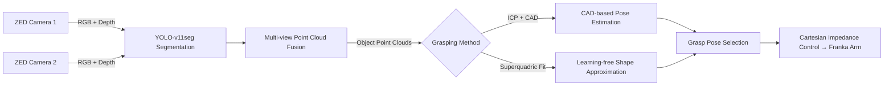

# Superquadric Grasp System

> **ROS 2 grasping pipeline** for industrial and research use, supporting two interchangeable perception strategies:  
> 1. **Model-based** — CAD/template alignment with ICP  
> 2. **Model-free, learning-free** — Hidden superquadrics for grasp pose generation

Optimized for **ZED stereo cameras** and **Franka Emika Panda** arms.  
Includes the complete chain: **perception → grasp planning → execution**.

<p align="center">
  
</p>

---

## Key Features

- **Plug-and-play perception** — Swap between CAD-based ICP and model-free superquadric fitting  
- **Multi-view fusion** — Combine point clouds from multiple ZED cameras  
- **Flexible grasp planning** — Supports both fixed CAD grasps and automatic grasp synthesis  
- **Robot-ready** — Includes Cartesian impedance demo for Franka Emika Panda  
- **Extensible** — Modular ROS 2 node structure for adding new perception or grasp planners  

---

## Table of Contents

- [System Overview](#system-overview)
- [Prerequisites](#prerequisites)
- [Installation](#installation)
- [Quick Start](#quick-start)
- [Configuration](#configuration)
- [Running Examples](#running-examples)
- [Controlling the Robot](#controlling-the-robot)
- [Troubleshooting](#troubleshooting)
- [Citations](#citations)
- [License & Contact](#license--contact)

---

## System Overview



---

## Prerequisites

- ROS 2 Humble (Ubuntu 22.04)  
- [ZED SDK 5.0.5](https://www.stereolabs.com/en-ch/developers/release)  
- [Franka ROS 2 packages](https://github.com/frankarobotics/franka_ros2)  
- CUDA-compatible GPU for YOLO-v11seg segmentation  

---

## Installation

1. **Clone the package into your ROS 2 workspace**
   ```bash
   cd ~/franka_ros2_ws/src
   git clone https://github.com/<your_repo>.git superquadric_grasp_system
   ```

2. **Install dependencies**
   ```bash
   cd ~/franka_ros2_ws
   rosdep install --from-paths src --ignore-src -r -y
   ```

3. **Download Finetuned YOLO models**
   ```bash
   python scripts/download_yolo_models.py   # or provide your own CAD files
   ```
   
4. **Download object models (required for ICP)**
   ```bash
   python scripts/download_object_models.py   # or provide your own CAD files
   ```
  
5. **Build**
   ```bash
   colcon build --packages-select superquadric_grasp_system
   source install/setup.bash
   ```

## Quick Start

1. **Set camera transforms**  
   Edit `config/transformations.yaml` (use the [camera calibration tool](https://github.com/MrGerencser/camera_calibration) to obtain transforms).

2. **Configure perception settings**  
   Edit `config/perception_config.yaml`:
   ```yaml
   grasping_method: "icp"         # Options: "icp", "superquadric"
   yolo_model_path: "models/yolov11seg.onnx"
   voxel_size: 0.005
   workspace_bounds: [-0.3, 0.3, -0.3, 0.3, 0.0, 0.4]
   ```

3. **Rebuild after config/model changes**
   ```bash
   cd ~/franka_ros2_ws
   colcon build --packages-select superquadric_grasp_system
   source install/setup.bash
   ```

4. **Launch perception**
   ```bash
   ros2 run superquadric_grasp_system perception_node
   ```

5. **Monitor output**
   ```bash
   ros2 topic echo /perception/object_pose
   ```

---

## Running Examples

- [**ICP (Model-based)**](examples/icp.md)  
  CAD-based alignment using ICP for known objects with available 3D models.

- [**Superquadric (Model-free)**](examples/superquadric.md)  
  Shape approximation from point clouds without requiring CAD models.

---

## Controlling the Robot

This repo includes a `grasp_executor.py` demo for grasp execution with the Cartesian Impedance Controller.

**Example workflow:**
```bash
# Terminal 1: Launch perception
ros2 run superquadric_grasp_system perception_node

# Terminal 2: Launch Cartesian impedance control
ros2 launch cartesian_impedance_control cartesian_impedance_controller.launch.py

# Terminal 3: Run grasp executor
python3 superquadric_grasp_system/grasp_executor.py
```

Set drop location inside `grasp_executor.py`:
```python
'drop_box': {'x': 0.2, 'y': 0.6, 'z': 0.18}
```


## Quick Start

1. **Set Camera Transforms**  
  Define camera transforms in:  
  `config/transformations.yaml`
  Use the [camera calibration tool](https://github.com/MrGerencser/camera_calibration) for getting transformations.

2. **Rebuild the Package**
  After changing any config files or models:
    ```bash
   cd ~/franka_ros2_ws
   colcon build --packages-select superquadric_grasp_system
   source install/setup.bash
   ```

3. **Launch the perception node**
   ```bash
   ros2 run superquadric_grasp_system perception_node
   ```

**Monitor output:**  
  ```bash
  ros2 topic echo /perception/object_pose
  ```

---

## Configuration

1. **Camera Transforms**  
   Edit `config/transformations.yaml`  
   Use the camera calibration tool to obtain transforms.

2. **Perception Settings**  
   Edit `config/perception_config.yaml`:
   ```yaml
   grasping_method: "icp"         # Options: "icp", "superquadric"
   yolo_model_path: "models/yolov11seg.onnx"
   voxel_size: 0.005
   workspace_bounds: [-0.3, 0.3, -0.3, 0.3, 0.0, 0.4]
   ```

---

## Running Examples

- [**ICP (Model-based)**](examples/icp.md)  
  CAD-based alignment using ICP for known objects with available 3D models.

- [**Superquadric (Model-free)**](examples/superquadric.md)  
  Shape approximation from point clouds without requiring CAD models.

---

## Controlling the Robot

This repo includes a `grasp_executor.py` demo for grasp execution with the Cartesian Impedance Controller.

**Example workflow:**
```bash
# Terminal 1: Launch perception
ros2 run superquadric_grasp_system perception_node

# Terminal 2: Launch Cartesian impedance control
ros2 launch cartesian_impedance_control cartesian_impedance_controller.launch.py

# Terminal 3: Run grasp executor
python3 superquadric_grasp_system/grasp_executor.py
```

Set drop location inside `grasp_executor.py`:
```python
'drop_box': {'x': 0.2, 'y': 0.6, 'z': 0.18}
```

---

## Troubleshooting

**No point cloud received**
- Check camera connection and drivers
- Verify topic names in config match actual published topics

**Poor shape fitting**
- Adjust `fitting_tolerance` parameter
- Ensure good lighting and clear object visibility

**Failed grasp execution**
- Check robot safety limits and collision settings
- Verify transforms between perception and robot frames

---

## Citations

If you use this work, please cite:
- YOLOv11 Segmentation
- Hidden Superquadrics
- ICP

---

## License & Contact

Licensed under the MIT License.  
For questions and support, open an issue or
