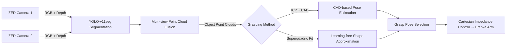

# Superquadric Grasp System

> **ROS 2 grasping pipeline** - modular setup for industrial and research use, supporting two interchangeable perception strategies:  
> 1. "**Model-based** — CAD/template alignment via ICP. Each model includes a grasp YAML file with predefined grasp points, enabling direct pose-to-grasp mapping."
> 2. "**Model-free, learning-free** — Hidden superquadrics for grasp pose generation. [Original Paper](https://arxiv.org/abs/2305.06591)"

Object detection is powered by a **YOLO segmentation** model (replaceable with other detection methods if desired).
Optimized for **ZED stereo cameras** and **Franka Emika Panda** arms.  
Provides an end-to-end chain: **perception → grasp planning → execution**.

<p align="center">
  
</p>



**Tested on:** ROS 2 Humble · Ubuntu 22.04 · ZED 2i (ZED SDK 5.0.5) · Franka Panda Emika

---

## Table of Contents

- [Prerequisites](#prerequisites)
- [Installation](#installation)
- [Quick Start](#quick-start)
- [Configuration](#configuration)
- [Running Examples](#running-examples)
- [Controlling the Robot](#controlling-the-robot)
- [Troubleshooting](#troubleshooting)
- [Citations](#citations)
- [License & Contact](#license--contact)


---

## Prerequisites

- ROS 2 Humble (Ubuntu 22.04)  
- [ZED SDK](https://www.stereolabs.com/en-ch/developers/release) - (tested with version 5.0.5)
- [Franka ROS 2 packages](https://github.com/frankarobotics/franka_ros2) (tested with v0.1.15)

---

## Installation

1. **Clone the package into your ROS 2 workspace**
   ```bash
   cd ~/franka_ros2_ws/src
   git clone https://github.com/MrGerencser/superquadric_grasp_system.git
   ```

2. **Install dependencies**
   ```bash
   cd ~/franka_ros2_ws
   rosdep install --from-paths src --ignore-src -r -y
   ```

3. **Download Finetuned YOLO models**
   ```bash
   python scripts/download_yolo_models.py   # or provide your own finetuned YOLO model
   ```
   
4. **Download object models (required for ICP)**
   ```bash
   python scripts/download_object_models.py   # or provide your own CAD files
   ```
  
5. **Build**
   ```bash
   colcon build --packages-select superquadric_grasp_system
   source install/setup.bash
   ```

## Quick Start

1. **Set camera transforms**  
   Edit `config/transformations.yaml` (use the [camera calibration tool](https://github.com/MrGerencser/camera_calibration) to obtain transforms).

2. **Configure perception settings**  
   Edit `config/perception_config.yaml`:
   ```yaml
   grasping_method: "icp"         # Options: "icp", "superquadric"
   yolo_model_path: "models/yolov11seg.pt"
   voxel_size: 0.005
   workspace_bounds: [-0.3, 0.3, -0.3, 0.3, 0.0, 0.4] #in robot frame
   ```

3. **Rebuild after config/model changes**
   ```bash
   cd ~/franka_ros2_ws
   colcon build --packages-select superquadric_grasp_system
   source install/setup.bash
   ```

4. **Launch perception**
   ```bash
   ros2 run superquadric_grasp_system perception_node
   ```

5. **Monitor output**
   ```bash
   ros2 topic echo /perception/object_pose
   ```

---

## Running Examples

- [**ICP (Model-based)**](examples/icp.md)  
  CAD-based alignment using ICP for known objects with available 3D models.

- [**Superquadric (Model-free)**](examples/superquadric.md)  
  Fits hidden superquadrics from raw point clouds — no CAD required.

---

## Controlling the Robot

This repo includes a [grasp_executor.py](superquadric_grasp_system/grasp_executor.py) demo for grasp execution with this [Cartesian Impedance Controller](https://github.com/MrGerencser/cartesian_impedance_control).       
[grasp_executor.py](superquadric_grasp_system/grasp_executor.py) doesn't include object avoidance or other safety filters.

**Example workflow:**
```bash
# Terminal 1: Launch perception
ros2 run superquadric_grasp_system perception_node

# Terminal 2: Launch Cartesian impedance control
ros2 launch cartesian_impedance_control cartesian_impedance_controller.launch.py

# Terminal 3: Run grasp executor
ros2 run superquadric_grasp_system grasp_executor
```

Set drop location inside `grasp_executor.py`:
```python
'drop_box': {'x': 0.2, 'y': 0.6, 'z': 0.18}
```

---

## Troubleshooting

---

## License & Contact

Licensed under the MIT License.  
For questions and support, open an issue or
